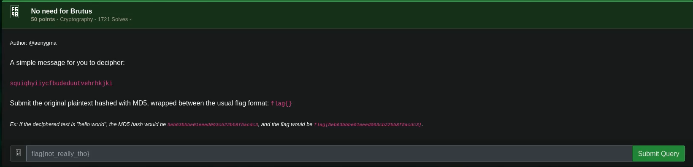

# No need for Brutus

## Challenge



> Hint here is the the word "Brutus" which is a reference to Marcus Junius Brutus who assassinated Julius **Caesar**.

## Solution

Original text: squiqhyiiycfbudeduutvehrhkjki

Decode the original with a Caesar cipher decoder.


> Tool used was www.dcode.fr .

We then get the string's md5sum with this command:

```bash
echo -E "caesarissimplenoneedforbrutus" | md5sum
```

## FLAG

```text
flag{18bdd83cee5690321bb14c70465d3408}
```
