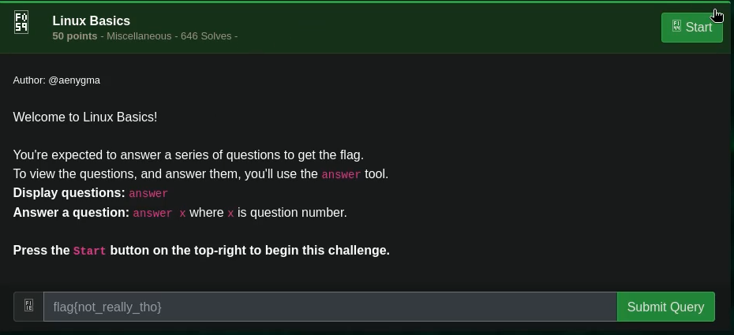

# Linux Basics

## Challenge



## Solution

0: What's your home directory?

```bash
pwd
```

```txt
/home/user
```

1: Search the man pages. What command would you use to generate random permutations?

```bash
apropos "random permutations"
```

```txt
shuf
```

2: On what day was /home/user/myfile.txt modified? Use the date format 2019-12-31

```bash
ls -la /home/user/myfile.txt
```

```txt
1997-08-29
```

3: How big is /home/user/myfile.txt, in kilobytes? Round to the nearest whole number.

```bash
ls -lah /home/user/myfile.txt
```

```txt
22
```

4: What user owns the file /home/user/myfile.txt?

```bash
ls -la /home/user/myfile.txt
```

```txt
root
```

5: What's the 3-digit octal permissions of the file /home/user/myfile.txt? (e.g 777)

```bash
ls -la /home/user/myfile.txt
```

```txt
754
```

6: What is the user id of 'admin'?

```bash
id admin
```

```txt
1338
```

7: There's a user 'john' on the system. Can he write to /home/user/myfile.txt? (yes/no)

```bash
ls -la /home/user/myfile.txt && cat /etc/group
```

```txt
no
```

8: Can the 'admin' user execute /home/user/myfile. txt? (yes/no)

```bash
ls -la /home/user/myfile.txt
```

```txt
yes
```

9: Which user on the system, except for you, root, admin and john, can execute /home/user/myfile.txt?

```bash
ls -la /home/user/myfile.txt && cat /etc/group
```

```txt
rose
```

11: /home/user/myfile.txt looks like a txt file, but it actually isn't. What kind of file is it?

```bash
file /home/user/myfile.txt
```

```txt
jpeg18bdd83cee5690321bb14c70465d3408
```

## FLAG

```text
flag{8873fe66f8e7a6019d7d71261864f6c5}
```
