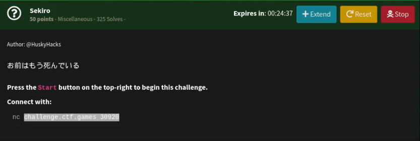
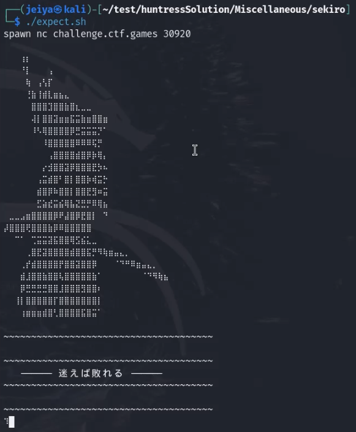

# Sekiro

## Challenge



## Solution



In this challenge, you are going to play a game where you type your move in response to the move of the challenge's samurai. In this game, you need to type fast and know the patterns.

```textile
opponent move: advance
your move: retreat

opponent move: block
your move: advance

opponent move: strike
your move: block

opponent move: retreat
your move: strike
```

After searching for a bit, I found that the command *expect* can answer netcat prompts for you. So I used it on Sekiro to automatically answer for me instead of typing out the answers.

```bash
which expect
```

```bash
#!/usr/bin/expect

spawn nc challenge.ctf.games 31390
while {1} {
    expect {
        "Opponent move: advance" {
            send "retreat\n"
        }
        "Opponent move: block" {
            send "advance\n"
        }
        "Opponent move: strike" {
            send "block\n"
        }
        "Opponent move: retreat" {
            send "strike\n"
        }
    }
}
```

## FLAG

```text
flag{a1ae4e5604576818132ce3bfebe95de5}
```
