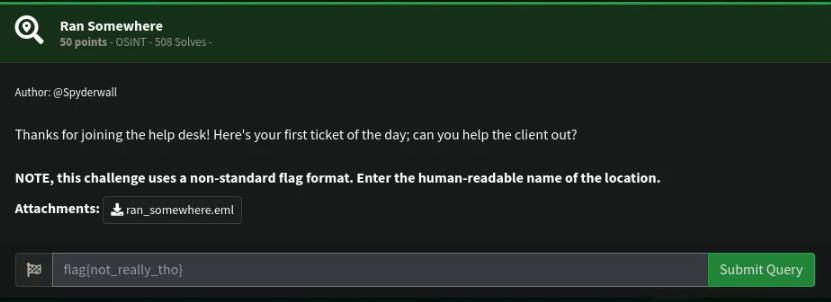
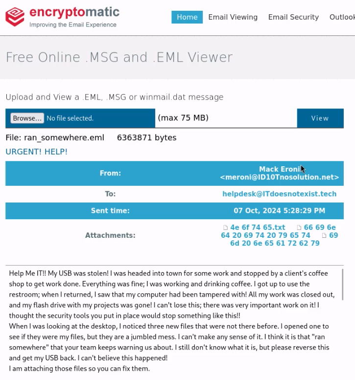
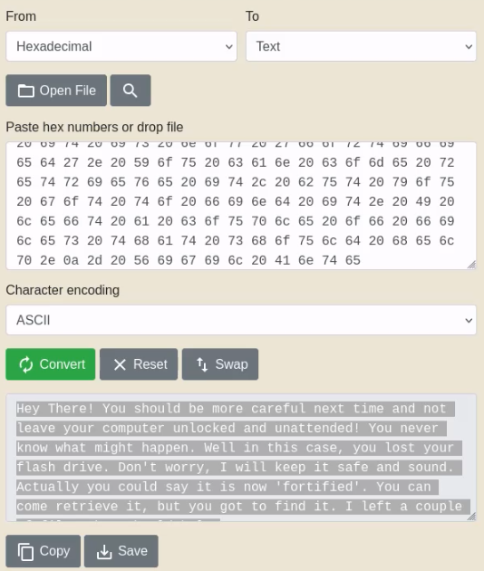
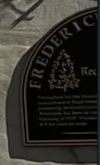

# Ran Somewhere

## Challenge



## Solution

Inside of the eml file (which stands for electronic mail), we can find 3 files (one is a txt file while the other 2 are jpeg files).



> Tool used was encryptomatic.com .

Inside of the txt file: we are given hex codes that we can decode to get a message that includes the hint/keyword "fortified".



> Tool used was rapidtables.com .

Inside of the jpeg images, we can see a picture of a castle or park. Zooming in, we can find clue as to where the picture was taken. But it was also worth trying to get the location from just the metdata.

```bash
exiftool image1.jpg && exiftool image2.jpg
```

Unfortunately, we could not get the location from the metadata. And so, using the clue from the zoomed in image, we can try searching for it in the internet.



The keywords I tried searching with was "frederick park reck plaque tree castle".


## FLAG

```text
reckord armory
```
