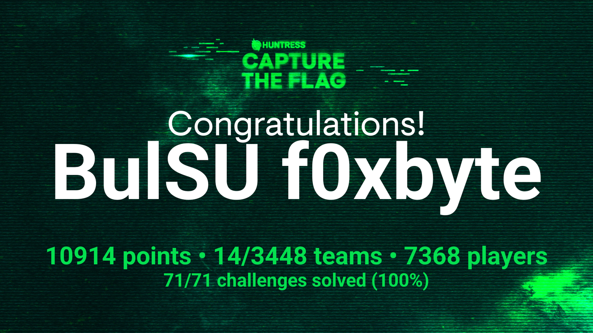

# Huntress CTF 2024 (Cybersecurity Awareness Month)

## Original Posting

[Huntress CTF](https://www.huntress.com/cybersecurity-education/cybersecurity-awareness)

## Description

Join the Huntress CTF, our month-long competition of daily challenges designed for experts and enthusiasts alike. Test your threat-hunting skills, gain hands-on experience facing off with real-world, simulated threats, and maybe even win a prize or two.

## CHALLENGES:

### Warmups

- [x] Feedback

- [x] Zulu

- [x] Typo

- [x] I Can't SSH

- [x] Unbelievable

- [x] TXT Message

- [x] Whamazon

- [x] Too Many Bits

- [x] Technical Support

- [x] Cattle

- [x] Read the Rules

- [x] MatryoshkaQR

- [x] Finders Fee

- [x] Mystery

- [x] The Void

### Web

- [ ] Zippy

- [ ] MOVEable

- [ ] PillowFight

- [ ] HelpfulDesk

- [ ] Plantopia

- [ ] Y2J

### Binary Exploitation

- [ ] ~~Baby Buffer Overflow~~
- [ ] In Plain Sight

### Reverse Engineering

- [ ] GoCrackMe3

- [ ] Stack It

- [ ] GoCrackMe2

- [ ] OceaLocust

- [ ] GoCrackMe1

- [ ] Rusty Bin

- [ ] That's Life

- [ ] Knight's Quest

- [ ] Stack It

### Cryptography

- [x] No need for Brutus
- [ ] Strive Marish Leadman TypeCDR

### Forensics

- [ ] Keyboard Junkie

- [ ] Zimmer Down

- [ ] Obfuscation Station

- [ ] Hidden Streams

- [ ] Ancient Fossil

- [ ] Backdoored Splunk II

### Malware

- [ ] Eco-Friendly

- [ ] eepy

- [ ] X-RAY

- [ ] Russian Roulette

- [ ] Discount Programming devices

- [ ] Strange Calc

- [ ] Mimi

- [ ] Rustline

- [ ] Palimpsest

- [ ] Revenge of Discount Programming Devices

- [ ] Ping Me

### Miscellaneous

- [ ] Permission to Proxy

- [ ] System Code

- [ ] 1200 Tranmissions

- [x] Sekiro

- [ ] Red Phish Blue Phish

- [ ] Malibu

- [x] Linux Basics

- [ ] Base-p-

- [ ] Time will tell

### Scripting

- [ ] Echo Chamber

- [x] Base64by32

### OSINT

- [x] Ran Somewhere

### Challenge Group

- [ ] Little Shop of Hashes

- [ ] Nightmare on Hunt Street
  
  - [x] 1
  
  - [x] 2
  
  - [ ] 3 (Learn psexec)
  
  - [x] 4
  
  - [x] 5

### Other's Write-ups

https://github.com/ChrisPritchard/ctf-writeups/tree/master

https://github.com/LazyTitan33/CTF-Writeups/tree/main

https://github.com/alphillips-lab/Huntress2024/tree/main 

https://github.com/Noderyos/HuntressCTF-2024

https://ctf.rdvsvr.com/posts/HuntressCTF2024/

https://github.com/Anon1984/Huntress.Ctf.2024

https://docs.google.com/spreadsheets/d/1xBNjyukgpjsRdkem81oKmFA8UegG7eZP57Q4wiugxEI/edit?pli=1&gid=0#gid=0

https://ha1fdan.xyz/posts/huntress-24/#nightmare-on-hunt-street

https://github.com/unremarkable-io/huntress2024-writeups/tree/main

https://blog.rice.is/post/palimpsest/

https://blog.ry4n.org/huntress-ctf-2024-oceanlocust-write-up-686984c5dc3c?gi=5ad0739261b0

https://blog.ry4n.org/huntress-ctf-2024-in-plain-sight-write-up-519610874c93?gi=85b743961a84

https://mwalkowski.com/post/huntress-ctf-2024/

https://github.com/OxT7723/CTFs

https://medium.com/@zzunaidd/huntress-ctf-2024-writeups-warmus-and-other-easy-ones-1a303d29a6e5
