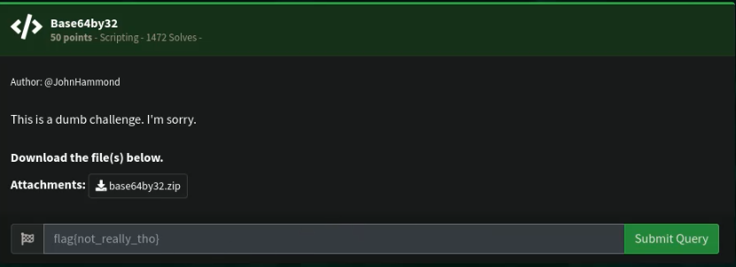

# Base64by32

## Challenge



> The hint here is this is a file that was encoded in base 64 32 times.

## Solution

I made a bash script that would make a new file for every time it decoded the file, until it reached 32. But, we must first rename the file to file1.

```bash
#!/bin/bash
for i in {1..32}
do
    let y=i++
    base64 --decode ./file$y >> ./file$i
done
```

## FLAG

```text
flag{8b3980f3d33f2ad2f531f5365d0e3970}
```
