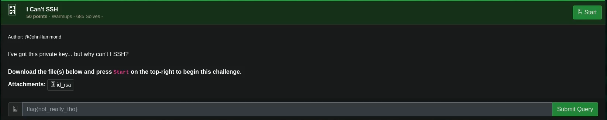

# I Can't SSH

## Challenge



## Solution

You use the private-key to authenticate SSH for user@challenge.ctf.games

```bash
ssh -i id -p 31764 user@challenge.ctf.games
```

Once inside the machine, you can simple cat the flag.txt found in the home directory of the user you ssh-ed into.

## FLAG

```text
flag{ee1f28722ec1ce1542aa1b486dbb1361}
```
