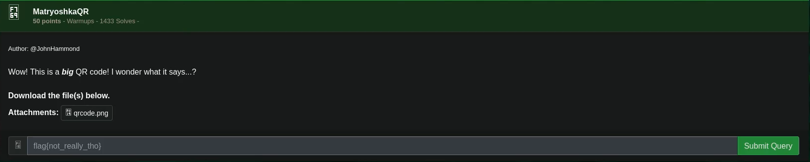
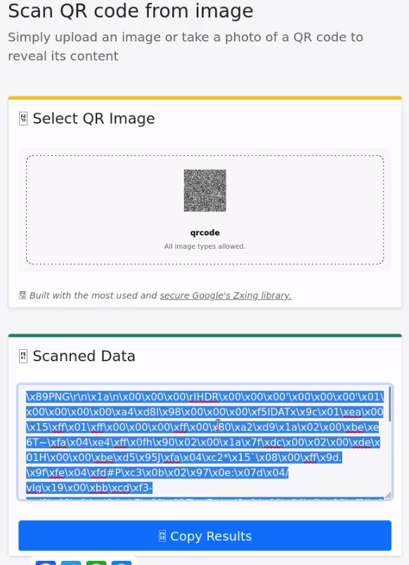
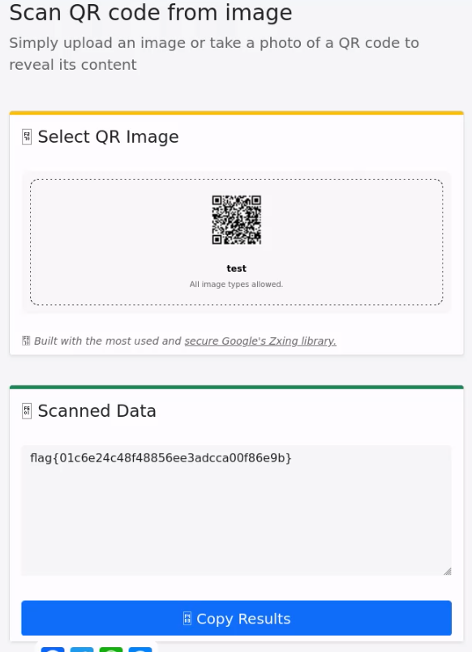

# MatryoshkaQR

## Challenge



## Solution

We scan the large QR code first.



> Tool used was scanqr.org .

I then use this python script made by ChatGPT to write the hex code onto the new file's hex.

```python
data = b"<hex code of first qr here>"

with open('qr.png', 'wb') as file:
    file.write(data)
```

And then scan the qr code again.



## ## FLAG

```text
flag{01c6e24c48f48856ee3adcca00f86e9b}
```
