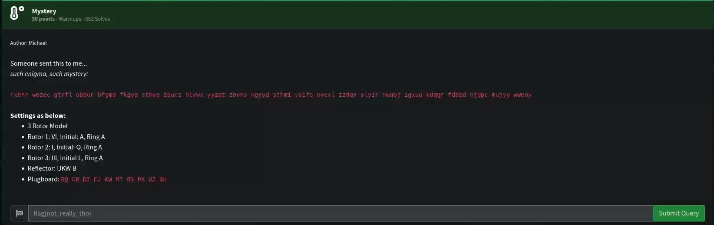
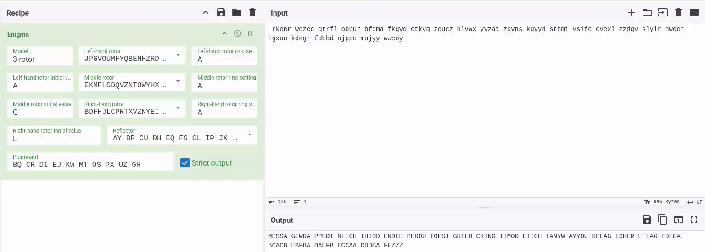

# Mystery

## Challenge



> The challenge description mentions the word "enigma" which is a reference to the Enigma machine which is a cipher device.

## Solution



The following decoded message is "message wrapped in light hidden deeper out of sight locking it more tight anyway your flag is here flag fdfeabcacbebfbadaefbeccaadddbafe zzz"

> Had trouble wondering why the flag did not work, turns out the zzz was not part of it.
> 
> Tool used was gchq.github.io/CyberChef .

## FLAG

```text
flag{fdfeabcacbebfbadaefbeccaadddbafe}
```
