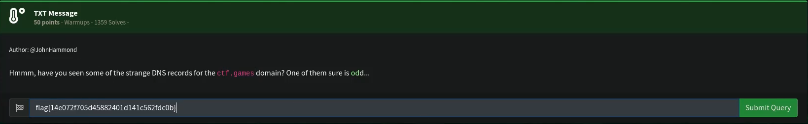
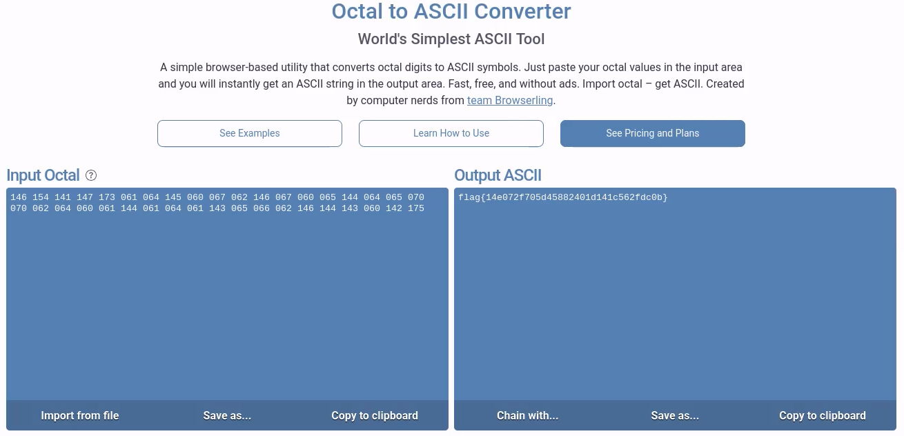

# TXT Message

## Challenge



## Solution

The challenge is asking us to look at the DNS records of *ctf.games*. We can check the DNS records with the following command:

```bash
dig +short ctf.games TXT
```

This gives us a string of Octal numbers. We can convert them to ASCII.



## ## FLAG

```text
flag{14e072f705d45882401d141c562fdc0b}
```
