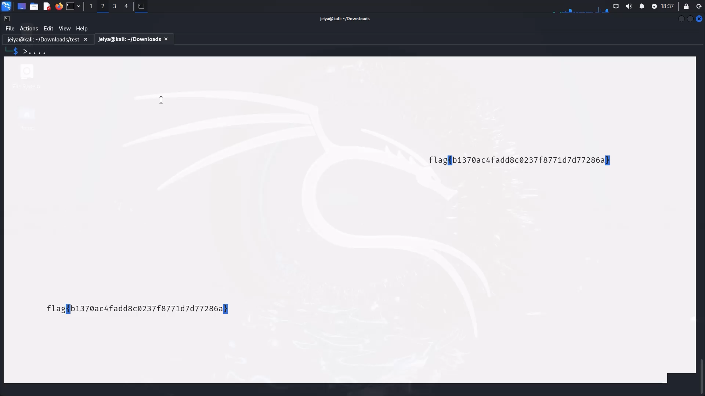

# The Void

## Challenge


## Solution

When we listen to the challenge with netcat, we get a bunch of empty echoes.


Selecting the screen and then copy and pasting it somewhere else gives us the flag.



## FLAG

```text
flag{b1370ac4fadd8c0237f8771d7d77286a}
```
