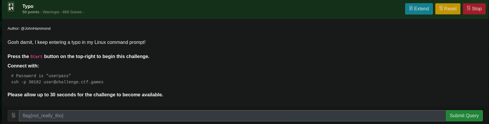
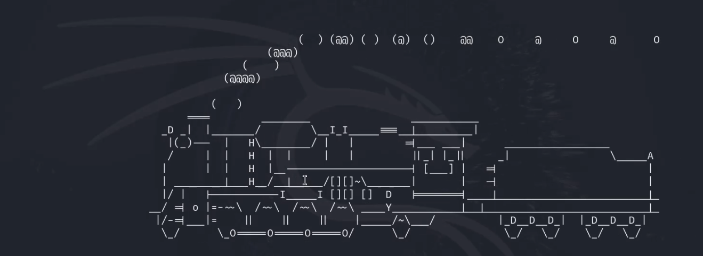

# Typo

## Challenge



## Solution

When SSH-ing into the challenge instance, we get a moving train and we can't input anything. Luckily for us, we can use a feature of SSH that allows us to run commands.



```bash
ssh -p 30182 user@challenge.ctf.games ls && \
ssh -p 30182 user@challenge.ctf.games cat flag.txt
```

## FLAG

```text
flag{36a0354fbf59df454596660742bf09eb}
```
