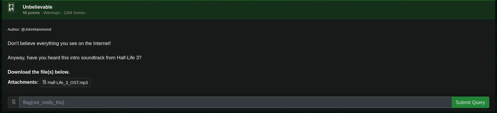
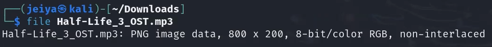

# Unbelievable

## Challenge



## Solution

I check the file type with the following command:

```bash
file Half-Life_3_OST.mp3
```



I open it as an image and then get the flag.

## FLAG

```text
flag{a85466991f0a8dc3d9837a5c32fa0c91}
```
