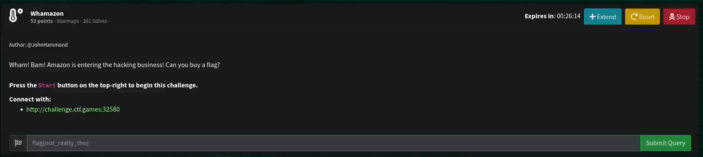

# Whamazon

## Challenge



In the challenge name, we are given the word "Brutus" which is a reference to Marcus Junius Brutus who was an assassin of Julius **Caesar**.

## Decoding

Original text:

```text
squiqhyiiycfbudeduutvehrhkjki
```

Deciphering with Caesar Cipher:


> Tool used is www.dcode.fr

Getting the MD5 hash:

```bash
echo -E "caesarissimplenoneedforbrutus" | md5sum
```

## FLAG

```text
flag{c945bb2173e7da5a292527bbbc825d3f}
```
