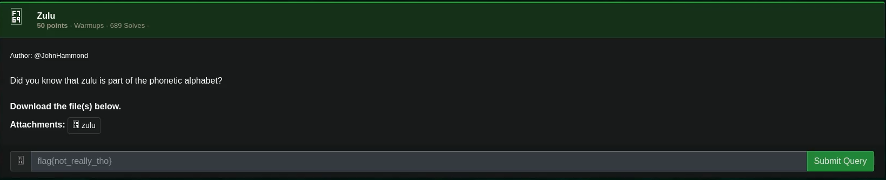
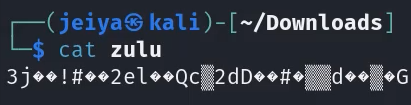
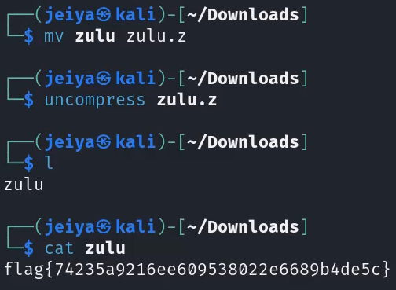

# Zulu

## Challenge



> The challenge description mentions the word "enigma" which is a reference to the Enigma machine which is a cipher device.

## Solution

I checked the file type using the following command:

```bash
file zulu
```

Which outputted *zulu: compress'd data 16 bits*

Checking the contents of the file with cat, we got this:



After searching, a compress'd file has .z as the file extension and can be decompressed with the following command:

```bash
mv zulu zulu.z && uncompress zulu.z
```



## FLAG

```text
flag{fdfeabcacbebfbadaefbeccaadddbafe}
```
