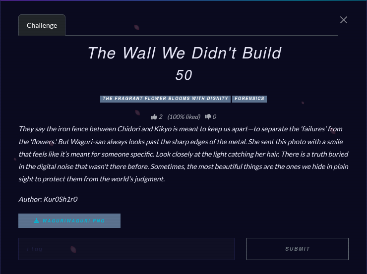

# The Wall We Didn't Buil

## Challenge



## Solution

Okay so we need to analyze this PNG image. Let's go through the usual.

```bash
file waguriwaguri.png
waguriwaguri.png: PNG image data, 1920 x 1080, 8-bit/color RGB, non-interlaced
```

It is indeed a PNG file.

```bash
strings waguriwaguri.png
# some text
kaoruko.txtUT	
[U&r?
mIPK
kaoruko.txtUT
```

It seems we found a file hidden inside this image.

```bash
binwalk -e waguriwaguri.png

DECIMAL       HEXADECIMAL     DESCRIPTION
--------------------------------------------------------------------------------
2483947       0x25E6EB        Zip archive data, encrypted at least v2.0 to extract, compressed size: 74, uncompressed size: 64, name: kaoruko.txt

WARNING: One or more files failed to extract: either no utility was found or it's unimplemented
```

There we go, we found a zip file... and it requires a password. Let's try brute-forcing it then.

```bash
zip2john 25E6EB.zip > hash.hash
ver 2.0 efh 5455 efh 7875 25E6EB.zip/kaoruko.txt PKZIP Encr: TS_chk, cmplen=74, decmplen=64, crc=97A6CC27 ts=58F3 cs=58f3 type=8

john --wordlist=/usr/share/wordlists/rockyou.txt hash.hash
Created directory: /home/jeiya/.john
Using default input encoding: UTF-8
Loaded 1 password hash (PKZIP [32/64])
Will run 4 OpenMP threads
Press 'q' or Ctrl-C to abort, almost any other key for status
fragrantlavander (25E6EB.zip/kaoruko.txt)     
1g 0:00:00:00 DONE (2026-06-04 22:15) 1.923g/s 15501Kp/s 15501Kc/s 15501KC/s francesnhope..four0422
Use the "--show" option to display all of the cracked passwords reliably
Session completed. 
```

Unlock the zip file with the password then we got the flag.

## FLAG

```text
k40ruk0{sh3_1s_r34lly_b34ut1ful_1_w1ll_r15k_3v3ryth1n6_f0r_h3r}
```
