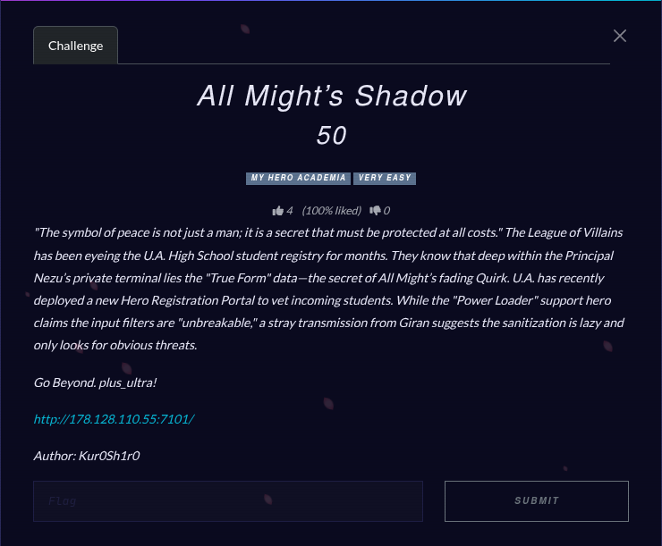
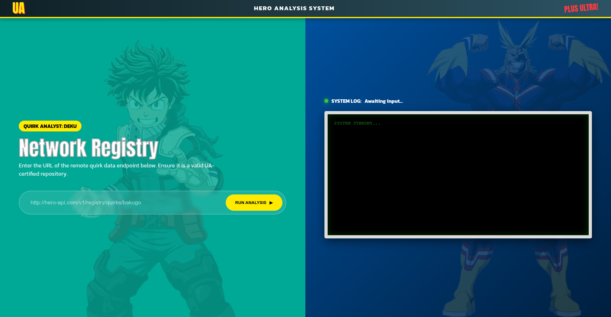
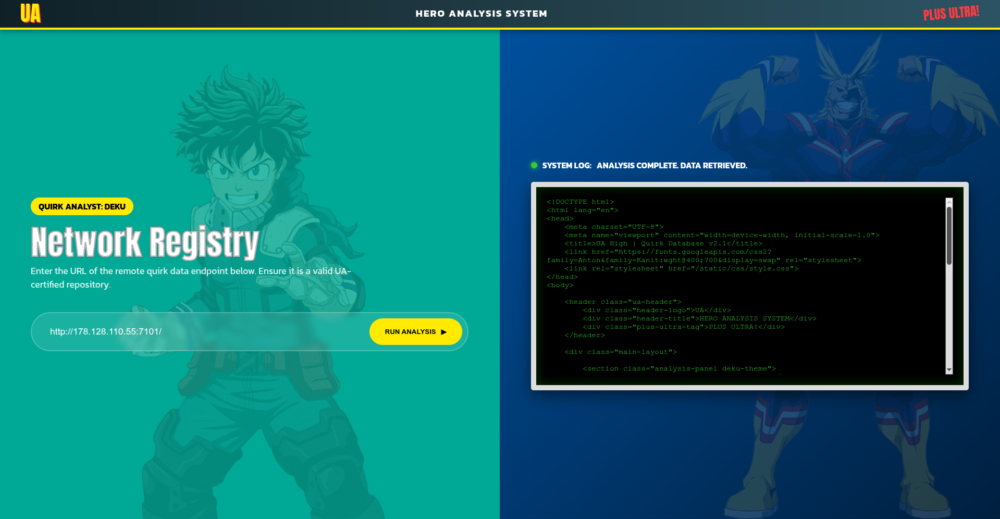
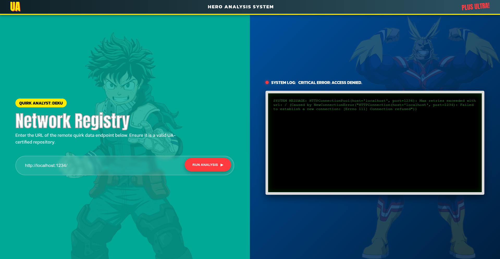
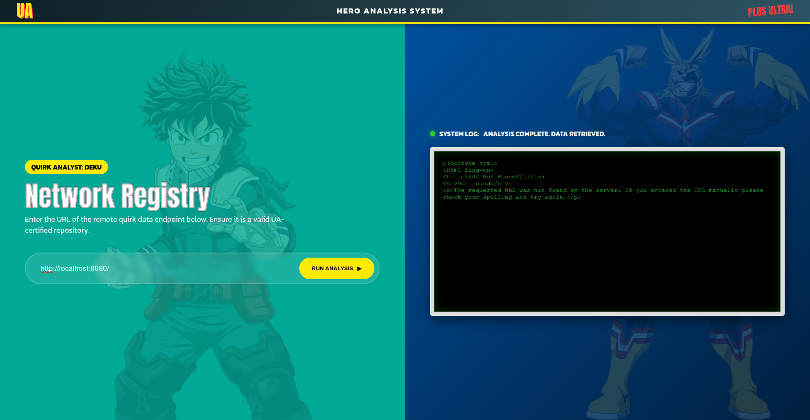

# All Might’s Shadow

## Challenge



## Solution

It seems we can input any url and it'll return us it's contents. A classic SSRF challenge.





Let's try and see if `localhost` or `127.0.0.1` works.



It works, nice. After that, let's start enumerating the ports on the localhost using Burp Suite's Intruder and see what we get.

We found port 8080 to be open but we don't have an index page to it's giving us a URL not found error. Let's try enumerating the directories and files under that port.




We found `/admin` pretty quickly but it gave us nothing, except hinting us that we might be on the right track. Let's try enumerating on that as a directory... We found nothing.

But thanks to my teammates help, he found something suspicious in the challenge description "Go Beyond. plus_ultra!". Hmmm, looks suspiciously like a file.


## FLAG

```text
plu5_ultr4{4ll_m1ght_15_th3_str0n63st_0f_th3m_4ll}
```
