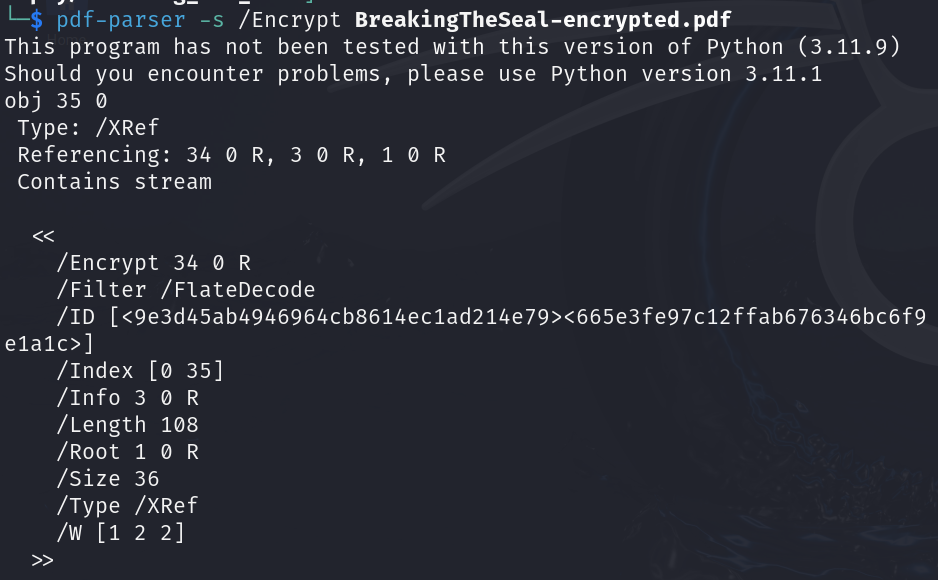
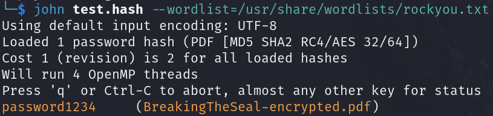
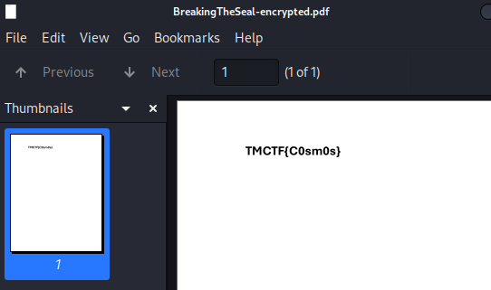

# Breaking the Seal

## Determining the File

```bash
file BreakingTheSeal-encrypted.pdf
```

The output shows us that it is a PDF document.

## Running the File

Running the file prompts us to input a password to open it.

## Decoding

```bash
pdfid -e BreakingTheSeal-encrypted.pdf
```

```textile
OUTPUT:
/Encrypt    1
```

This shows us that it is indeed encrypted because /Encrypt is set to 1. 

```bash
pdf-parser -s /Encrypt BreakingTheSeal-encrypted.pdf
```

This command parses the PDF with the search pattern of "/Encrypt".



```bash
pdf2john BreakingTheSeal-encrypted.pdf > pdf.hash
```

This command is a tool that would extract the hashes found in a PDF file.

With the hash and a good wordlist, we can start guessing the password.

```bash
john --wordlist=/usr/share/wordlist/rockyou.txt pdf.hash 
```





## SUCCESS

We have captured the TMCTF{C0sm0s} flag.
