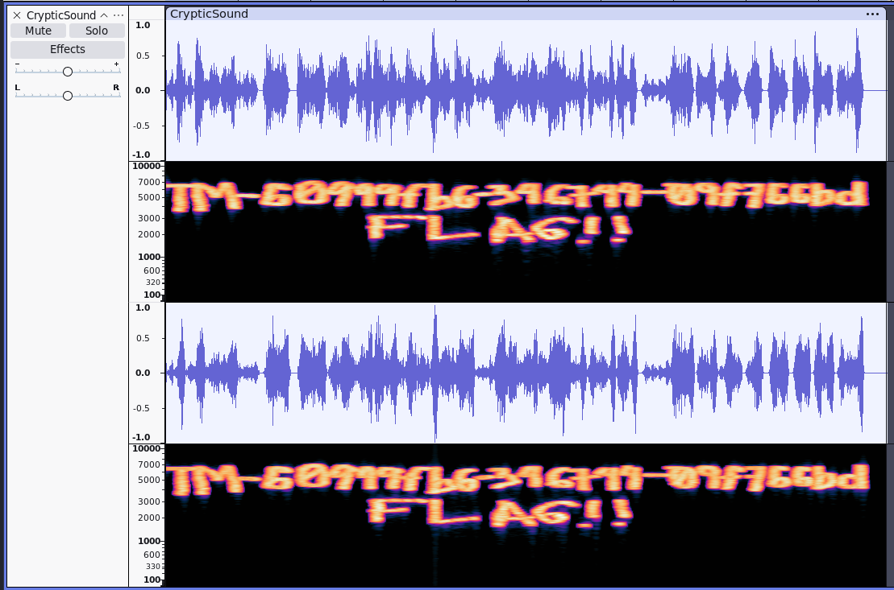

# Cryptic Sound

## Determining the File

```bash
file CrypticSound.wav
```

The output shows us the file is a WAVE file.

## Running the File

Using Audacity, we can listen to the sound file.

The audio from the sound file was just birds chirping.

## Decoding

Using the multi-view function of Audacity, we can find spectogram and waveform display which could show us hidden messages.



## SUCCESS

We have captured the TMCTF{TM-60999fb6–346744–09f766bd} flag.
