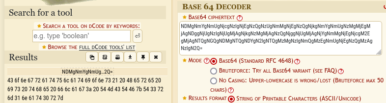
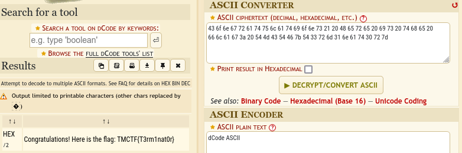

# Emergency Message

## Determining the File

```bash
file Emergency.png
```

The output shows us that it is a PNG image. 

## Running the File


## Decoding

Based on the last character being an equal sign "=", we can tell it is encoded in base64. Using an online decoder, we can get the decoded message.



We can see it is still encoded, but this time in Hexadecimal.



## SUCCESS

We have captured the TMCTF{T3rm1nat0r} flag.
