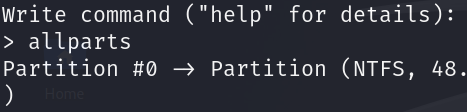
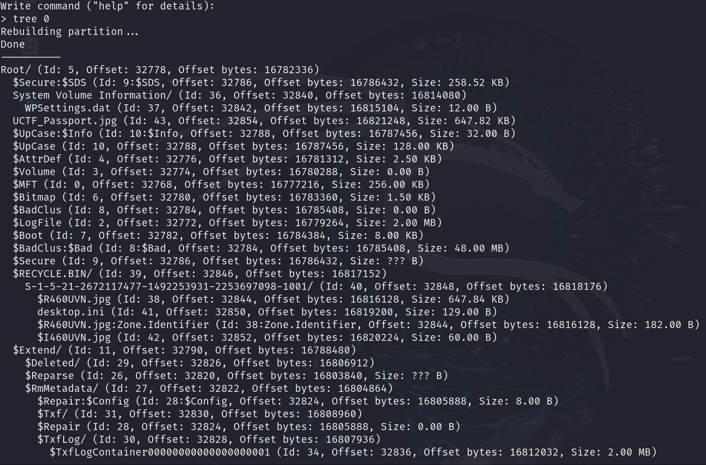
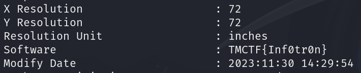

# Lost Passport

## Determining the File

```bash
file LostPassport
```

The output shows us that it is a EWF file, which we have never heard of before.

After searching, an E01/EWF file (developed by EnCase) is a digital forensics tool to create disk images.

## Recovering the File

Using this [CTF-writeup](https://gist.github.com/Rajchowdhury420/9c6cfbcc0c9b367cd646e54db1ada7d2) by Rajchowdhury240 on an EWF file, we can follow the steps they did to extract the flag.

But before that, we need to install `ewf-tools`.

```bash
sudo apt install ewf-tools
```

Then we can start following the steps in the writeup.

```bash
mv LostPassport LostPassport.E01 && \
mkdir E01 && \
ewfmount LostPassport.E01 E01 && \
cd E01 && file *
```

The output of file shows us that we have a DOS/MBR boot sector in the image.

With the [Lazza/RecuperaBit](https://github.com/Lazza/RecuperaBit) tool, we can recover files from the image.

```bash
git clone https://github.com/Lazza/RecuperaBit.git && \
cd ../ && \
mkdir output && \
python3 Recupera/main.py E01/ewf1 -o output && \
```

Once we press enter to let the program start the analysis, we are given a prompt to input commands.

We use `allparts` to list all the partitions.



We use `tree 0` to show the contents of partition.



Based on the output, we can see that there is a file named "UCTF_Passport.jpg" with an id of 43.

```bash
recover 0 43
```

With that, we have recovered the file and placed it into the output directory.

Running the file, we can see a passport with nothing suspicious.

Using `exiftool`, we can see the metadata stored within the image.



## Success

We have captured the TMCTF{Inf0tr0n} flag.
