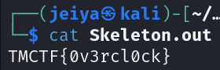

# Skeleton in My Closet

## Determining the File

```bash
file Skeleton
```

The output shows us it is a bzip2 file.

> In Linux, the system determines the file type based on the content rather than the file extension.

## Running the File

```bash
bzip2 -d Skeleton
```

We get a file called "Skeleton.out". Running `file` on it again shows us it is a plain text ASCII file.

```bash
cat Skeleton.out
```



## SUCCESS

We have captured the TMCTF{0v3rcl0ck} flag.