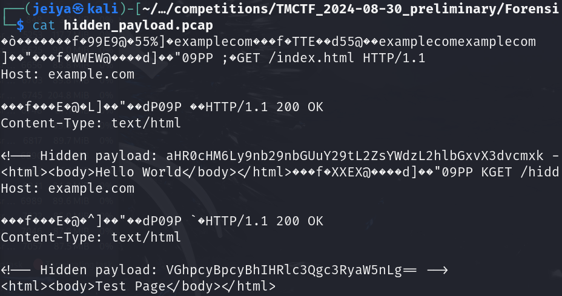
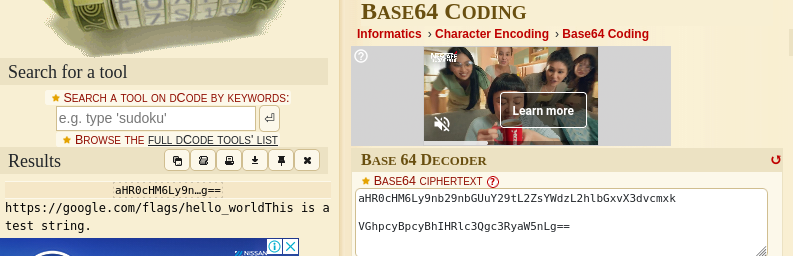

# Hidden Payload

## Determining the File

```bash
file hidden_payload.pcap
```

The output shows us this is a PCAP capture file (raw ipv4). I was unfamiliar with this file type.

## Running the File

```bash
cat hidden_payload.pcap
```

Since I didn't know how to open this file type. I opened it like a normal ASCII text file.



Here we can see two encoded payloads. One of them is base64 due to ending in "=", while the other one I couldn't immediately know what it was encoded in.



After decoding, we can see we have a link. The link used to lead us to the flag but it seems it can't be accessed anymore.

## SUCCESS

We have captured the TMCTF{https://google.com/flags/hello_world} flag.