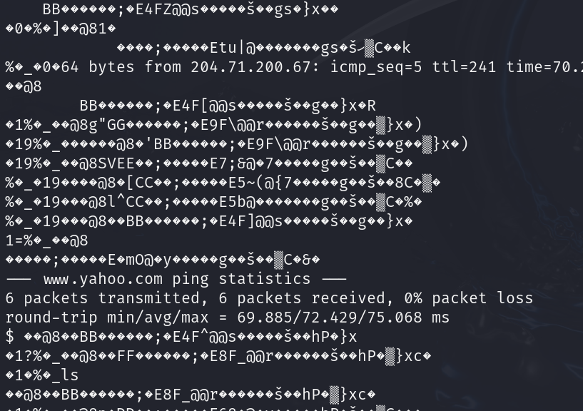

# Tracing the Trail

## Determining the File

```bash
file TracingTheTrail.pcap
```

The output shows us this is a PCAP capture file (raw ipv4). I was unfamiliar with this file type.

## Running the File

```bash
cat TracingTheTrail.pcap
```

Since I didn't know how to open this file type. I opened it like a normal ASCII text file.



## SUCCESS

We have captured the TCMCTF{www.yahoo.com} flag.