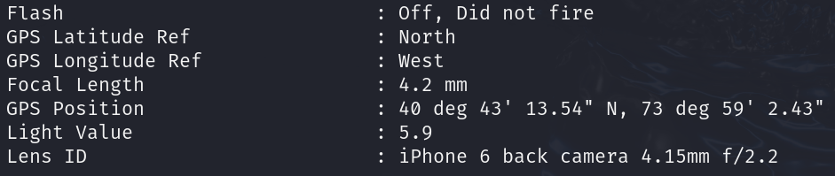

# One Friend

## Determining the File

```bash
file OneFriend.png
```

The output shows us that it is a PNG image file.

## Running the File

Opening the file, we are greeted with a cat sitting.

## Analyzing the File

```bash
exiftool OneFriend.png
```

Using `exiftool`, we can extract the metadata from the image, including the GPS position of where the photo was taken.



Using Google maps, we can find the approximate area.

## SUCCESS

Unfortunately, we don't know the correct answer to this.
