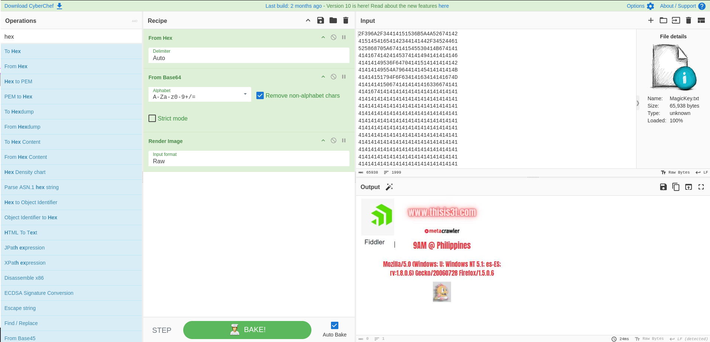

# One Friend

## Determining the File

```bash
file MagicKey.txt
```

The output shows us that it is an ASCII text file.

## Running the File

Opening the file, we can see a long list of numbers.

## Analyzing the File

Based on '2F', we can guess this is hexadecimals. With Cyberchef's magic feature, it automatically detects that is base64 encoded and can be rendered as an image.



## SUCCESS

We have captured the flag TMCTF{www.thisis3t.com}.


