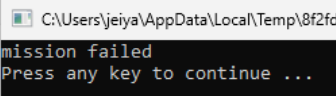
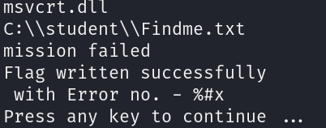
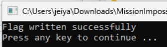
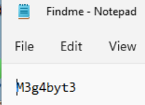

# Mission Impossible

## Determining the File

```bash
file MissionImpossible.exe
```

The output shows us that it is a "PE32+ executable x86_64 for MS Windows", which basically means it is an actual EXE file.

## Running the File



## Reverse Engineering the File

```bash
strings MissionImpossible.exe
```



In the final lines of the output, we can see that the program is looking for a file in the C:\student\ directory.

So using the File explorer. I created a student/ directory in C and created a file under it name "Findme.txt".

Running the file again, we get this.



Inside the file, we can find the flag.



## SUCCESS

We have captured the M3g4byt3 flag.

> During the challenge, the Flag format was supposed to be TMCF{flag} but ended up as just flag. The team lost a lot of points and time because of it.