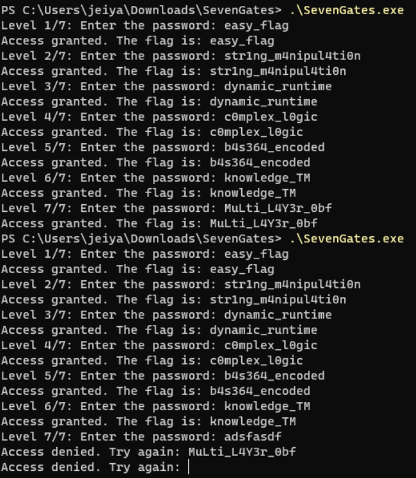

# The Seven Gates

## Determining the File

```bash
file SevenGates.exe
```

The output shows us that it is a "PE32+ executable x86_64 for MS Windows", which basically means it is an actual EXE file.

## Running the File

When running the file in Windows Terminal, it prompts us for a password in 7 levels.

## Reverse Engineering the File

Using Ghidra, we can check the reverse engineered code of SevenGates.

Level 1:


Converting the hex values of local_82 and local_72 to ASCII, we get "alf_ysae" and "g" respectively. Reading this backwards with local_7a moved to the end of the string, we get "easy_flag".

Level 2:


Converting the hex values of local_81, local_8d, and local_85 to ASCII, we get "m_gn1rts", "t4lupin4" and "n0i" respectively. Again, we can guess what the password is based on reading this. We get "str1ng_m4npul4ti0n".

Level 3:


Unlike other level functions, this one has a *generate_password* function which takes in local_e8.


Converting the hex values of local_28 and local_10 to ASCII, we get "_cimanyd" and "emitnur" respectively. Again, we can guess what the password is based on reading this. We get "dynamic_runtime".

Level 4:


Converting the hex values of local_86, uStack_80, and uStack_7e to ASCII, we get "elpm0c", "_x" and "cig0l" respectively. Again, we can guess what the password is based on reading this. We get "c0mplex_l0gic".

Level 5:


Converting the hex values of local_87, uStack_80, and uStack_7f to ASCII, we get "_463s4b", "e" and "dedocn" respectively. Again, we can guess what the password is based on reading this. We get "b4s364_encoded".

Level 6:


Converting the hex values of local_85, uStack_80, and uStack_7d to ASCII, we get "lwonk", "gde" and "MT_e" respectively. Again, we can guess what the password is based on reading this. We get "knolwdge_TM".

Level 7:


Converting the hex values of local_98, local_90, and local_1c to ASCII, we get "4L_itLuM", "fb0_r3Y" and "«" respectively. Again, we can guess what the password is based on reading this. We get "MuLti_L4Y3r_0bf".

Flag:



One thing I found of note with the last flag, is that the previous levels allowed you to have mistakes and the program will still accept the password if it is correct. In level 7, if you inputted the password wrong once, even the correct password wont work.

## SUCCESS

We have captured the MuLti_L4Y3r_0bf flag.
