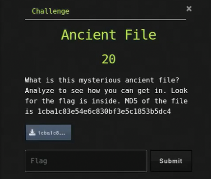

# Ancient File

## Challenge



## Solution

We need to check what file it is.

```bash
file 1cba1c83e54e6c830bf3e5c1853b5dc4
```

It is a LHa archive that we need to extract. 7-zip which comes with kali actually supports LHa, so let's use that.

```bash
7z x 1cba1c83e54e6c830bf3e5c1853b5dc4
```

We get a `words.txt` file which we can grep the flag for.

```bash
grep uCTF words.txt
```

## FLAG

```text
uCTF{4_Haruyasu_Yoshizaki_}
```
