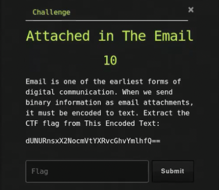

# Attached in The Email

## Challenge



## Solution

We can simply decode the base64 encoded string.

```bash
echo -E 'dUNURnsxX2NocmVtYXRvcGhvYmlhfQ==' | base64 -d
```

## FLAG

```text
uCTF{4_Haruyasu_Yoshizaki_}
```
