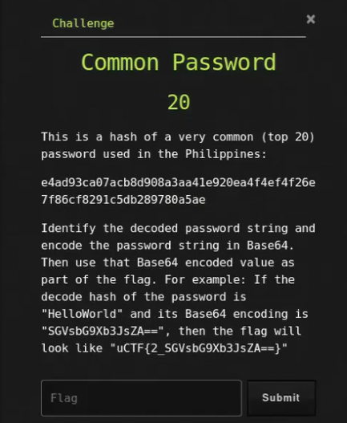

# Ancient File

## Challenge



## Solution

Using websites such as [hashes.com](https://hashes.com/en/decrypt/hash) and [crackstation.net](https://crackstation.net/), we get the password "iloveyou". We can verify that with the following command:

```bash
echo -E 'iloveyou' | sha256sum
```

After verifying it, we can now encode it in base64.

```bash
echo -E "iloveyou" | base64
```

## FLAG

```text
uCTF{2_aWxvdmV5b3U=}
```
