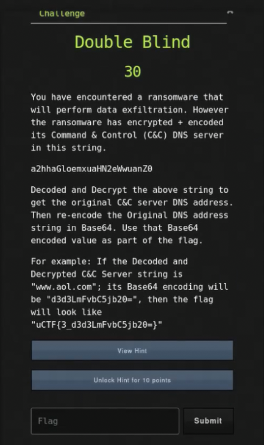

# Ancient File

## Challenge



## Solution

The string seems to be base64 encoded.

```bash
echo -E 'a2hhaGloemxuaHN2eWwuanZ0' | base64 -d 
```

Judging by the alphabetical text along with the '.' character, it seems to be a domain name that was substitution ciphered. The most common ciphers in these scenarios is rotation cipher or caesar cipher.

```bash
echo -E 'databasegalore.com' | base64
```

## FLAG

```text
uCTF{3_}
```
