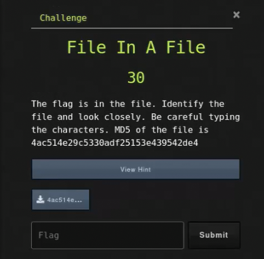

# File In A File

## Challenge



## Solution

We need to check what file it is.

```bash
file 4ac514e29c5330adf25153e439542de4
```

It is an xz archive we need to extract. But, we can do this in three ways

#### Method 1 (using individual commands)

```bash
mv 4ac514e29c5330adf25153e439542de4 4ac514e29c5330adf25153e439542de4.xz && \
unxz 4ac514e29c5330adf25153e439542de4.xz && \
# this gives us the same filename but in LZ4 compressed data this time
mv 4ac514e29c5330adf25153e439542de4 4ac514e29c5330adf25153e439542de4.lz4 && \
lz4 -d 4ac514e29c5330adf25153e439542de4.lz4 && \
# this gives us the same filename but in zstandard compressed data this time
mv 4ac514e29c5330adf25153e439542de4 4ac514e29c5330adf25153e439542de4.zst && \
zstd -d 4ac514e29c5330adf25153e439542de4.zst && \
# this gives us the same filename but in rar compressed data this time
mv 4ac514e29c5330adf25153e439542de4 4ac514e29c5330adf25153e439542de4.rar && \
rar x 4ac514e29c5330adf25153e439542de4.rar && \
# this gives us the file 'file3' whcih is a zip file
unzip file3 && \
# this gives us the file 'file2' whcih is a bzip2 file
bzip2 -d file2 && \
# this gives us the file 'file2.out' whcih is a gzip file
mv file2.out file2.out.gz && gzip -d file2.out.gz && \
# this gives us the file 'file2.out' whcih is a tar file
tar xvf file2.out

# this gives us a words2.txt which we'll check after trying the other methods
```

#### Method 2 (using the 7z command)

7zip can automatically determine the compression type and decompress it without changing the file suffix.

```bash
7z x <filename>
```

#### Method 3 (using the GUI)

Any distribution that supports a lot of compression formats, should be able to just extract these files.


We can now find the flag inside of `words2.txt`.

```bash
grep uCTF words2.txt
```

## FLAG

```text
uCTF{10_7KSlGUfES#6QjDce}
```
