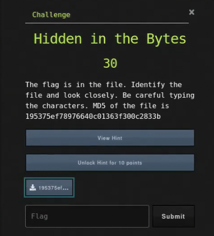

# Ancient File

## Challenge



## Solution

We need to check what file it is.

```bash
file 195375ef78976640c01363f300c2833b
```

We  have a PNG image file. My first instinct to these media formats is to use `zsteg` or `exiftool` to check for any obvious flags.

```bash
zsteg 195375ef78976640c01363f300c2833b
```

## FLAG

```text
uCTF{7_AyS6QwhL-4KRxtpe}
```
