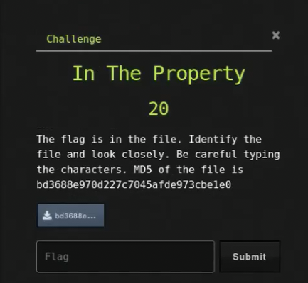

# In The Property

## Challenge



## Solution

We need to check what file it is.

```bash
file bd3688e970d227c7045afde973cbe1e0
```

We  have a PNG image file. My first instinct to these media formats is to use `zsteg` or `exiftool` to check for any obvious flags.

```bash
exiftool bd3688e970d227c7045afde973cbe1e0
```

## FLAG

```text
uCTF{}
```
