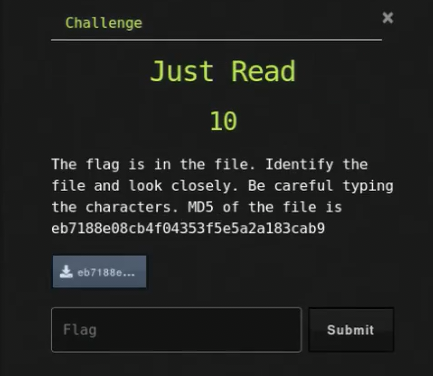

# Ancient File

## Challenge



## Solution

We need to check what file it is.

```bash
file 195375ef78976640c01363f300c2833b
```

We  have a PNG image file. Opening it, we can already see the flag, we just need to type it out. Using a flaptak application called "Frog", we can extract the text from the image and then correct it.

## FLAG

```text
uCTF{5_7Prsv=aDo7x8#5DEZ}
```
