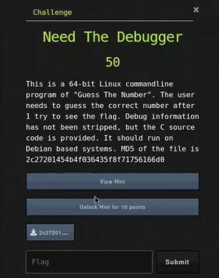
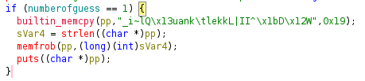

# Need The Debugger

## Challenge



## Solution

We need to check what file it is.

```bash
file 2c27201454b4f036435f8f71756166d0
```

It is a Linux 64-bit executable. When ran, it prompts the user to enter a number between 1 and 1000. According to the challenge, it needs to be guess with just one attempt. 

#### Method 1: Live debugging

We can use any C debugger such the cli gdb, CLion, or VSCode. For this writeup, I shall use gdb.

```bash
gdb ./2c27201454b4f036435f8f71756166d0
```

```bash
(gdb) disassemble main # we find a functin called do_guess
(gdb) disassemble do_guess # we find the line where the variable 'number' is set
(gdb) break *do_guess+64 # you could also go to ay other byte number like 67, as long it is before the user input
(gdb) run
(gdb) print number
(gdb) continue # this starts the progrm normally, where the user must input
# after inputting the correct value of the number, the flag is printed
```

#### Method 2: Decompilation

Using ghidra, we can find the block of code that contains the flag.



According to this [c - Design and usage of the memfrob function - Stack Overflow](https://stackoverflow.com/questions/27207768/design-and-usage-of-the-memfrob-function) post, it just XORs strings with the decimal 42. It does this just to not show the string easily with the `strings` command. So we can simply XOR the given string with decimal 42 (0x2A).

## FLAG

```text
uCTF{9_KDA#FOAAfVcct1n8}
```
