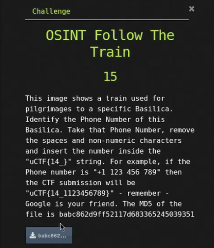

# OSINT Follow The Train

## Challenge



## Solution

We need to check what file it is.

```bash
file 195375ef78976640c01363f300c2833b
```

We  have a PNG image file. Opening it, we can find a red train that is a bit blurry, blurry enough to where we can't make out any text.

The key here is to search the keywords such as 'Basilica', 'pilgrimages', and 'train'. This gives us the Basilica of Notre-Dame de Fourvière. The official contact number for the foundation/basilica is **+33 4 78 25 13 01**.

## FLAG

```text
uCTF{14_33478251301}
```
