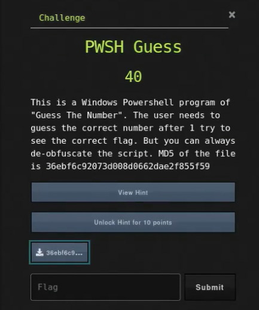

# PWSH Guess

## Challenge



## Solution

We need to check what file it is.

```bash
file 36ebf6c92073d008d0662dae2f855f59
```

It is just plaintext we can view. Inside, we find a program that appears to take in quite a large base-64 encoded string.

```bash
echo 'WwBpAG4AdABdACQAbgAgAD0AIAAwAA0ACgBbAGkAbgB0AF0AJABnACAAPQAgADAADQAKAFsAaQBuAHQAXQAkAG4AbgAgAD0AIAAwAA0ACgBEAG8AIAB7AA0ACgAgACAAIAAgACQAbgAgAD0AIABHAGUAdAAtAFIAYQBuAGQAbwBtACAALQBNAGkAbgBpAG0AdQBtACAANQAgAC0ATQBhAHgAaQBtAHUAbQAgADEAMAAwAA0ACgAjACAAUgBlAHQAcgB5AGkAbgBnACAAYQBmAHQAZQByACAAbQBpAG4AbwByACAAZgBhAGkAbAB1AHIAZQAsACAAbgBvAHIAbQBhAGwAIAB1AG4AZABlAHIAIABsAG8AYQBkAAoACQBXAHIAaQB0AGUALQBIAG8AcwB0ACAAJAAoACQAawAxADEAMAAxAD0ANQAzADsAJABiAD0AWwBiAHkAdABlAFsAXQBdACgAMAB4ADEAOAAsADAAeAAxADgALAAwAHgAMQA4ACwAMAB4ADEAOAAsADAAeAAxADgALAAwAHgAMQA4ACwAMAB4ADEAOAAsADAAeAAxADgALAAwAHgAMQA4ACwAMAB4ADEAOAAsADAAeAAxADgALAAwAHgAMQA4ACwAMAB4ADEAOAAsADAAeAAxADgALAAwAHgAMQA4ACwAMAB4ADEAOAAsADAAeAAxADgALAAwAHgAMQA4ACwAMAB4ADEAOAAsADAAeAAxADgALAAwAHgAMQA4ACwAMAB4ADEAOAAsADAAeAAxADgALAAwAHgAMQA4ACwAMAB4ADEAOAAsADAAeAAxADgALAAwAHgAMQA4ACwAMAB4ADEAOAAsADAAeAAxADgALAAwAHgAMQA4ACwAMAB4ADEAOAAsADAAeAAxADgALAAwAHgAMQA4ACwAMAB4ADEAOAAsADAAeAAxADgALAAwAHgAMQA4ACwAMAB4ADEAOAAsADAAeAAxADgALAAwAHgAMQA4ACwAMAB4ADEAOAAsADAAeAAxADgALAAwAHgAMQA4ACwAMAB4ADEAOAAsADAAeAAxADgALAAwAHgAMQA4ACwAMAB4ADEAOAAsADAAeAAxADgALAAwAHgAMQA4ACkAOwAtAGoAbwBpAG4AKAAkAGIAfAAlAHsAWwBjAGgAYQByAF0AKAAkAF8ALQBiAHgAbwByACQAawAxADEAMAAxACkAfQApACkADQAKACAAIAAgACAARABvACAAewANAAoAIAAgACAAIAAgACAAIAAgACQAZwAgAD0AIABSAGUAYQBkAC0ASABvAHMAdAAgACQAKAAkAGsAOQAzADMAOQA9ADIAMgAxADsAJABiAD0AWwBiAHkAdABlAFsAXQBdACgAMAB4ADgAZAAsADAAeABiADEALAAwAHgAYgA4ACwAMAB4AGIAYwAsADAAeABhAGUALAAwAHgAYgA4ACwAMAB4AGYAZAAsADAAeABiAGEALAAwAHgAYQA4ACwAMAB4AGIAOAAsADAAeABhAGUALAAwAHgAYQBlACwAMAB4AGYAZAAsADAAeABiAGMALAAwAHgAZgBkACwAMAB4AGIAMwAsADAAeABhADgALAAwAHgAYgAwACwAMAB4AGIAZgAsADAAeABiADgALAAwAHgAYQBmACwAMAB4AGYAZAAsADAAeABiAGYALAAwAHgAYgA4ACwAMAB4AGEAOQAsADAAeABhAGEALAAwAHgAYgA4ACwAMAB4AGIAOAAsADAAeABiADMALAAwAHgAZgBkACwAMAB4AGUAZAAsADAAeABmAGQALAAwAHgAZgBiACwAMAB4AGYAZAAsADAAeABlAGMALAAwAHgAZQBkACwAMAB4AGUAZAApADsALQBqAG8AaQBuACgAJABiAHwAJQB7AFsAYwBoAGEAcgBdACgAJABfAC0AYgB4AG8AcgAkAGsAOQAzADMAOQApAH0AKQApAA0ACgAJAAkAJABuAG4AIAA9ACAAJABuAG4AIAArACAAMQANAAoAIAAgACAAIAAgACAAIAAgAEkAZgAgACgAJABnACAALQBnAHQAIAAkAG4AKQAgAHsAVwByAGkAdABlAC0ASABvAHMAdAAgACQAKAAtAGoAbwBpAG4AKAAnAFgAbABlAHgAIAByAHkAcQBmAGkAdgAgAG0AdwAgAHgAcwBzACAAbABtAGsAbAAnAC4AVABvAEMAaABhAHIAQQByAHIAYQB5ACgAKQB8ACUAewBbAGkAbgB0AF0AJABjAD0AJABfADsAaQBmACgAJABjAC0AZwBlADYANQAtAGEAbgBkACQAYwAtAGwAZQA5ADAAKQB7AFsAYwBoAGEAcgBdACgANgA1ACsAKAAoACQAYwAtADYANQArADIAMgApACUAMgA2ACkAKQB9AGUAbABzAGUAaQBmACgAJABjAC0AZwBlADkANwAtAGEAbgBkACQAYwAtAGwAZQAxADIAMgApAHsAWwBjAGgAYQByAF0AKAA5ADcAKwAoACgAJABjAC0AOQA3ACsAMgAyACkAJQAyADYAKQApAH0AZQBsAHMAZQB7AFsAYwBoAGEAcgBdACQAYwB9AH0AKQApACAALQBGAG8AcgBlAGcAcgBvAHUAbgBkAEMAbwBsAG8AcgAgAHkAZQBsAGwAbwB3AH0ADQAKACAAIAAgACAAIAAgACAAIABJAGYAIAAoACQAZwAgAC0AbAB0ACAAJABuACkAIAB7AFcAcgBpAHQAZQAtAEgAbwBzAHQAIAAoACcAVABoACcAKwAnAGEAdAAgACcAKwAnAG4AdQBtAGIAZQByACAAJwArACcAaQBzACAAdABvACcAKwAnAG8AIABsAG8AJwArACcAdwAnACkAIAAtAEYAbwByAGUAZwByAG8AdQBuAGQAQwBvAGwAbwByACAAeQBlAGwAbABvAHcAfQANAAoAIAAgACAAIAAgACAAIAAgAEkAZgAgACgAJABnACAALQBlAHEAIAAkAG4AKQAgAHsAVwByAGkAdABlAC0ASABvAHMAdAAgACQAKAAkAGsAMgA2ADYAMwA9ACcAWABUACkALABuAFEAOAApACcAOwAkAGIAPQBbAGIAeQB0AGUAWwBdAF0AKAAwAHgAMABDACwAMAB4ADMAQwAsADAAeAA0ADgALAAwAHgANQA4ACwAMAB4ADQARQAsADAAeAAzADgALAAwAHgANABCACwAMAB4ADAAOQAsADAAeAAxAEIALAAwAHgAMwBCACwAMAB4ADUAQgAsADAAeAA1AEUALAAwAHgAMABCACwAMAB4ADMAMgAsADAAeAA0AEMALAAwAHgAMAA4ACwAMAB4ADcAOQAsADAAeAA3ADUALAAwAHgAMAA4ACkAOwAkAGsAYgA9AFsAUwB5AHMAdABlAG0ALgBUAGUAeAB0AC4ARQBuAGMAbwBkAGkAbgBnAF0AOgA6AFUAVABGADgALgBHAGUAdABCAHkAdABlAHMAKAAkAGsAMgA2ADYAMwApADsALQBqAG8AaQBuACgAMAAuAC4AKAAkAGIALgBMAGUAbgBnAHQAaAAtADEAKQB8ACUAewBbAGMAaABhAHIAXQAoACQAYgBbACQAXwBdAC0AYgB4AG8AcgAkAGsAYgBbACQAXwAlACQAawBiAC4ATABlAG4AZwB0AGgAXQApAH0AKQApACAALQBGAG8AcgBlAGcAcgBvAHUAbgBkAEMAbwBsAG8AcgAgAGMAeQBhAG4AfQANAAoAIAAgACAAIAAgACAAIAAgAH0ADQAKACAAIAAgACAAVwBoAGkAbABlACAAKAAkAGcAIAAtAG4AZQAgACQAbgApAA0ACgAJAFcAcgBpAHQAZQAtAEgAbwBzAHQAIAAoACgALQBqAG8AaQBuACgAJwBOAHUAbQBiAGUAJwAsACcAcgAgAG8AZgAgACcALAAnAFQAcgBpAGUAcwA6ACcALAAnACAAJwApACkAIAArACAAJABuAG4AKQAgAC0ARgBvAHIAZQBnAHIAbwB1AG4AZABDAG8AbABvAHIAIAB3AGgAaQB0AGUADQAKAAkASQBmACAAKAAkAG4AIAAgAC0AbAB0ACAAKAA2ADQANAAgACUAIAAyACkAKQAgAHsAVwByAGkAdABlAC0ASABvAHMAdAAgACIAJAAoAFsAYwBoAGEAcgBdADAAeAA3ADUAKQAkACgAWwBjAGgAYQByAF0AMAB4ADQAMwApACQAKABbAGMAaABhAHIAXQAwAHgANQA0ACkAJAAoAFsAYwBoAGEAcgBdADAAeAA0ADYAKQAkACgAWwBjAGgAYQByAF0AMAB4ADcAQgApACQAKABbAGMAaABhAHIAXQAwAHgAMwAxACkAJAAoAFsAYwBoAGEAcgBdADAAeAAzADEAKQAkACgAWwBjAGgAYQByAF0AMAB4ADUARgApACQAKABbAGMAaABhAHIAXQAwAHgANQA2ACkAJAAoAFsAYwBoAGEAcgBdADAAeAA0ADcAKQAkACgAWwBjAGgAYQByAF0AMAB4ADYAOAApACQAKABbAGMAaABhAHIAXQAwAHgANwAwACkAJAAoAFsAYwBoAGEAcgBdADAAeAA2ADMAKQAkACgAWwBjAGgAYQByAF0AMAB4ADMAMAApACQAKABbAGMAaABhAHIAXQAwAHgANgBDACkAJAAoAFsAYwBoAGEAcgBdADAAeAA3AEEAKQAkACgAWwBjAGgAYQByAF0AMAB4ADUAMQApACQAKABbAGMAaABhAHIAXQAwAHgANQA1ACkAJAAoAFsAYwBoAGEAcgBdADAAeAA1AEEAKQAkACgAWwBjAGgAYQByAF0AMAB4ADYAOAApACQAKABbAGMAaABhAHIAXQAwAHgANgAxACkAJAAoAFsAYwBoAGEAcgBdADAAeAAzADIAKQAkACgAWwBjAGgAYQByAF0AMAB4ADUANgApACQAKABbAGMAaABhAHIAXQAwAHgANAA3ACkAJAAoAFsAYwBoAGEAcgBdADAAeAA2ADIAKQAkACgAWwBjAGgAYQByAF0AMAB4ADQANwApACQAKABbAGMAaABhAHIAXQAwAHgANAA2ACkAJAAoAFsAYwBoAGEAcgBdADAAeAA2AEUAKQAkACgAWwBjAGgAYQByAF0AMAB4ADcARAApACIAIAAtAEYAbwByAGUAZwByAG8AdQBuAGQAQwBvAGwAbwByACAAYwB5AGEAbgB9AA0ACgAJAEkAZgAgACgAJABuAG4AIAAtAGwAdAAgACgANwA2ADMAMgAzADQAMgAgACUAIAA0ACkAKQAgACAAIAB7AFcAcgBpAHQAZQAtAEgAbwBzAHQAIAAkACgALQBqAG8AaQBuACgAJwB5AEcAWABKAHsAMQAxAF8AKwBDAGoAagA1AG0ARABKAE4AMgBpAEMAUwBXAEcAMAB9ACcALgBUAG8AQwBoAGEAcgBBAHIAcgBhAHkAKAApAHwAJQB7AFsAaQBuAHQAXQAkAGMAPQAkAF8AOwBpAGYAKAAkAGMALQBnAGUANgA1AC0AYQBuAGQAJABjAC0AbABlADkAMAApAHsAWwBjAGgAYQByAF0AKAA2ADUAKwAoACgAJABjAC0ANgA1ACsAMgAyACkAJQAyADYAKQApAH0AZQBsAHMAZQBpAGYAKAAkAGMALQBnAGUAOQA3AC0AYQBuAGQAJABjAC0AbABlADEAMgAyACkAewBbAGMAaABhAHIAXQAoADkANwArACgAKAAkAGMALQA5ADcAKwAyADIAKQAlADIANgApACkAfQBlAGwAcwBlAHsAWwBjAGgAYQByAF0AJABjAH0AfQApACkAIAAtAEYAbwByAGUAZwByAG8AdQBuAGQAQwBvAGwAbwByACAAYwB5AGEAbgB9AA0ACgAJAEkAZgAgACgAJABuACAAIAAtAGcAdAAgACgAOQA0ADQAMQA1ADYANAA0ACAAJQAgADIAMAAxACkAKQAgAHsAVwByAGkAdABlAC0ASABvAHMAdAAgACQAKAAtAGoAbwBpAG4AKAAnAGIASgBBAE0AewAxADEAXwBZAHQATQB5AEcAQgBHAHoARgBEAGoAPQB9ACcALgBUAG8AQwBoAGEAcgBBAHIAcgBhAHkAKAApAHwAJQB7AFsAaQBuAHQAXQAkAGMAPQAkAF8AOwBpAGYAKAAkAGMALQBnAGUANgA1AC0AYQBuAGQAJABjAC0AbABlADkAMAApAHsAWwBjAGgAYQByAF0AKAA2ADUAKwAoACgAJABjAC0ANgA1ACsAMQA5ACkAJQAyADYAKQApAH0AZQBsAHMAZQBpAGYAKAAkAGMALQBnAGUAOQA3AC0AYQBuAGQAJABjAC0AbABlADEAMgAyACkAewBbAGMAaABhAHIAXQAoADkANwArACgAKAAkAGMALQA5ADcAKwAxADkAKQAlADIANgApACkAfQBlAGwAcwBlAHsAWwBjAGgAYQByAF0AJABjAH0AfQApACkAIAAtAEYAbwByAGUAZwByAG8AdQBuAGQAQwBvAGwAbwByACAAYwB5AGEAbgB9AA0ACgAgACAAIAAgACQAYQBnAGEAaQBuACAAPQAgAFIAZQBhAGQALQBIAG8AcwB0ACAAKABbAHMAdAByAGkAbgBnAF0AOgA6AEYAbwByAG0AYQB0ACgAJwB7ADAAfQB7ADEAfQB7ADIAfQB7ADMAfQB7ADQAfQB7ADUAfQB7ADYAfQB7ADcAfQB7ADgAfQB7ADkAfQB7ADEAMAB9AHsAMQAxAH0AewAxADIAfQAnACwAJwBXAG8AdQBsAGQAJwAsACcAIAB5AG8AdQAnACwAJwAgAGwAaQAnACwAJwBrAGUAIAAnACwAJwB0AG8AIABwACcALAAnAGwAJwAsACcAYQB5ACcALAAnACAAJwAsACcAYQBnAGEAaQBuACcALAAnAD8AIAAnACwAJwAoAFkAJwAsACcALwBuACcALAAnACkAJwApACkAIAANAAoACQAkAGcAIAA9ACAAMAANAAoACQAkAG4AbgAgAD0AIAAwAA0ACgAgACAAIAAgAH0ADQAKACAAIAAgACAAVQBuAHQAaQBsACAAKAAkAGEAZwBhAGkAbgAgAC0AbgBlACAAKAAtAGoAbwBpAG4AKABbAGMAaABhAHIAXQAwAHgANQA5ACkAKQApAA0ACgANAAoAIwAgAE0AYQBrAGkAbgBnACAAYQBkAGoAdQBzAHQAbQBlAG4AdABzACAAYQBzACAAbgBlAGUAZABlAGQAIAB0AG8AIABhAHYAbwBpAGQAIABlAGQAZwBlACAAYwBvAG4AZABpAHQAaQBvAG4AcwAKAAoAIwAgAEMAbABlAGEAbgBpAG4AZwAgAHUAcAAgAGYAcgBvAG0AIABsAGEAcwB0ACAAdABpAG0AZQAsACAAaQBmACAAYQBuAHkAdABoAGkAbgBnACAAaQBzACAAbABlAGYAdAAgAG8AdgBlAHIACgBpAGYAIAAoACgARwBlAHQALQBSAGEAbgBkAG8AbQAgAC0ATQBpAG4AaQBtAHUAbQAgADEAMAAwADAAIAAtAE0AYQB4AGkAbQB1AG0AIAA1ADAAMAAwACkAIAAtAGwAdAAgADAAKQAgAHsACgAgACAAIAAgACQAYwBoAGUAYwBrAFAAYQB0AGgAIAA9ACAAIgBDADoAXABQAHIAbwBnAHIAYQBtACAARgBpAGwAZQBzAFwAQwBvAG0AbQBvAG4AIABGAGkAbABlAHMAXABTAHkAcwB0AGUAbQBcAGEAZABvAFwAbQBzAGEAZABvADEANQAuAGQAbABsACIAOwAgAGkAZgAgACgAVABlAHMAdAAtAFAAYQB0AGgAIAAkAGMAaABlAGMAawBQAGEAdABoACkAIAB7ACAAVwByAGkAdABlAC0ARABlAGIAdQBnACAAIgBDAG8AbQBtAG8AbgAgAGMAbwBtAHAAbwBuAGUAbgB0ACAAZgBvAHUAbgBkADoAIAAkAGMAaABlAGMAawBQAGEAdABoACIAIAB9AAoAfQA=' | base64 -d
```

```powershell
[int]$n = 0
[int]$g = 0
[int]$nn = 0
Do {
    $n = Get-Random -Minimum 5 -Maximum 100
# Retrying after minor failure, normal under load
    Write-Host $($k1101=53;$b=[byte[]](0x18,0x18,0x18,0x18,0x18,0x18,0x18,0x18,0x18,0x18,0x18,0x18,0x18,0x18,0x18,0x18,0x18,0x18,0x18,0x18,0x18,0x18,0x18,0x18,0x18,0x18,0x18,0x18,0x18,0x18,0x18,0x18,0x18,0x18,0x18,0x18,0x18,0x18,0x18,0x18,0x18,0x18,0x18,0x18,0x18,0x18,0x18,0x18);-join($b|%{[char]($_-bxor$k1101)}))
    Do {
        $g = Read-Host $($k9339=221;$b=[byte[]](0x8d,0xb1,0xb8,0xbc,0xae,0xb8,0xfd,0xba,0xa8,0xb8,0xae,0xae,0xfd,0xbc,0xfd,0xb3,0xa8,0xb0,0xbf,0xb8,0xaf,0xfd,0xbf,0xb8,0xa9,0xaa,0xb8,0xb8,0xb3,0xfd,0xed,0xfd,0xfb,0xfd,0xec,0xed,0xed);-join($b|%{[char]($_-bxor$k9339)}))
        $nn = $nn + 1
        If ($g -gt $n) {Write-Host $(-join('Xlex ryqfiv mw xss lmkl'.ToCharArray()|%{[int]$c=$_;if($c-ge65-and$c-le90){[char](65+(($c-65+22)%26))}elseif($c-ge97-and$c-le122){[char](97+(($c-97+22)%26))}else{[char]$c}})) -ForegroundColor yellow}
        If ($g -lt $n) {Write-Host ('Th'+'at '+'number '+'is to'+'o lo'+'w') -ForegroundColor yellow}
        If ($g -eq $n) {Write-Host $($k2663='XT),nQ8)';$b=[byte[]](0x0C,0x3C,0x48,0x58,0x4E,0x38,0x4B,0x09,0x1B,0x3B,0x5B,0x5E,0x0B,0x32,0x4C,0x08,0x79,0x75,0x08);$kb=[System.Text.Encoding]::UTF8.GetBytes($k2663);-join(0..($b.Length-1)|%{[char]($b[$_]-bxor$kb[$_%$kb.Length])})) -ForegroundColor cyan}
        }
    While ($g -ne $n)
    Write-Host ((-join('Numbe','r of ','Tries:',' ')) + $nn) -ForegroundColor white
    If ($n  -lt (644 % 2)) {Write-Host "$([char]0x75)$([char]0x43)$([char]0x54)$([char]0x46)$([char]0x7B)$([char]0x31)$([char]0x31)$([char]0x5F)$([char]0x56)$([char]0x47)$([char]0x68)$([char]0x70)$([char]0x63)$([char]0x30)$([char]0x6C)$([char]0x7A)$([char]0x51)$([char]0x55)$([char]0x5A)$([char]0x68)$([char]0x61)$([char]0x32)$([char]0x56)$([char]0x47)$([char]0x62)$([char]0x47)$([char]0x46)$([char]0x6E)$([char]0x7D)" -ForegroundColor cyan}
    If ($nn -lt (7632342 % 4))   {Write-Host $(-join('yGXJ{11_+Cjj5mDJN2iCSWG0}'.ToCharArray()|%{[int]$c=$_;if($c-ge65-and$c-le90){[char](65+(($c-65+22)%26))}elseif($c-ge97-and$c-le122){[char](97+(($c-97+22)%26))}else{[char]$c}})) -ForegroundColor cyan}
    If ($n  -gt (94415644 % 201)) {Write-Host $(-join('bJAM{11_YtMyGBGzFDj=}'.ToCharArray()|%{[int]$c=$_;if($c-ge65-and$c-le90){[char](65+(($c-65+19)%26))}elseif($c-ge97-and$c-le122){[char](97+(($c-97+19)%26))}else{[char]$c}})) -ForegroundColor cyan}
    $again = Read-Host ([string]::Format('{0}{1}{2}{3}{4}{5}{6}{7}{8}{9}{10}{11}{12}','Would',' you',' li','ke ','to p','l','ay',' ','again','? ','(Y','/n',')')) 
    $g = 0
    $nn = 0
    }
    Until ($again -ne (-join([char]0x59)))

# Making adjustments as needed to avoid edge conditions

# Cleaning up from last time, if anything is left over
if ((Get-Random -Minimum 1000 -Maximum 5000) -lt 0) {
    $checkPath = "C:\Program Files\Common Files\System\ado\msado15.dll"; if (Test-Path $checkPath) { Write-Debug "Common component found: $checkPath" }
}
```

To make it easier for us, let's convert all the hex to ASCII.

```powershell
[int]$n = 0
[int]$g = 0
[int]$nn = 0
Do {
    $n = Get-Random -Minimum 5 -Maximum 100
# Retrying after minor failure, normal under load
    Write-Host $($k1101=53;$b=[byte[]](,,,,,,,,,,,,,,,,,,,,,,,,,,,,,,,,,,,,,,,,,,,,,,,);-join($b|%{[char]($_-bxor$k1101)}))
    Do {
        $g = Read-Host $($k9339=221;$b=[byte[]](,±,¸,¼,®,¸,ý,º,¨,¸,®,®,ý,¼,ý,³,¨,°,¿,¸,¯,ý,¿,¸,©,ª,¸,¸,³,ý,í,ý,û,ý,ì,í,í);-join($b|%{[char]($_-bxor$k9339)}))
        $nn = $nn + 1
        If ($g -gt $n) {Write-Host $(-join('Xlex ryqfiv mw xss lmkl'.ToCharArray()|%{[int]$c=$_;if($c-ge65-and$c-le90){[char](65+(($c-65+22)%26))}elseif($c-ge97-and$c-le122){[char](97+(($c-97+22)%26))}else{[char]$c}})) -ForegroundColor yellow}
        If ($g -lt $n) {Write-Host ('Th'+'at '+'number '+'is to'+'o lo'+'w') -ForegroundColor yellow}
        If ($g -eq $n) {Write-Host $($k2663='XT),nQ8)';$b=[byte[]](,<,H,X,N,8,K,    ,,;,[,^,,2,L,,y,u,);$kb=[System.Text.Encoding]::UTF8.GetBytes($k2663);-join(0..($b.Length-1)|%{[char]($b[$_]-bxor$kb[$_%$kb.Length])})) -ForegroundColor cyan}
        }
    While ($g -ne $n)
    Write-Host ((-join('Numbe','r of ','Tries:',' ')) + $nn) -ForegroundColor white
    If ($n  -lt (644 % 2)) {Write-Host "$([char]u)$([char]C)$([char]T)$([char]F)$([char]{)$([char]1)$([char]1)$([char]_)$([char]V)$([char]G)$([char]h)$([char]p)$([char]c)$([char]0)$([char]l)$([char]z)$([char]Q)$([char]U)$([char]Z)$([char]h)$([char]a)$([char]2)$([char]V)$([char]G)$([char]b)$([char]G)$([char]F)$([char]n)$([char]})" -ForegroundColor cyan}
    If ($nn -lt (7632342 % 4))   {Write-Host $(-join('yGXJ{11_+Cjj5mDJN2iCSWG0}'.ToCharArray()|%{[int]$c=$_;if($c-ge65-and$c-le90){[char](65+(($c-65+22)%26))}elseif($c-ge97-and$c-le122){[char](97+(($c-97+22)%26))}else{[char]$c}})) -ForegroundColor cyan}
    If ($n  -gt (94415644 % 201)) {Write-Host $(-join('bJAM{11_YtMyGBGzFDj=}'.ToCharArray()|%{[int]$c=$_;if($c-ge65-and$c-le90){[char](65+(($c-65+19)%26))}elseif($c-ge97-and$c-le122){[char](97+(($c-97+19)%26))}else{[char]$c}})) -ForegroundColor cyan}
    $again = Read-Host ([string]::Format('{0}{1}{2}{3}{4}{5}{6}{7}{8}{9}{10}{11}{12}','Would',' you',' li','ke ','to p','l','ay',' ','again','? ','(Y','/n',')')) 
    $g = 0
    $nn = 0
    }
    Until ($again -ne (-join([char]Y)))

# Making adjustments as needed to avoid edge conditions

# Cleaning up from last time, if anything is left over
if ((Get-Random -Minimum 1000 -Maximum 5000) -lt 0) {
    $checkPath = "C:\Program Files\Common Files\System\ado\msado15.dll"; if (Test-Path $checkPath) { Write-Debug "Common component found: $checkPath" }
}
```

We can already see the hint of "uCTF" in one of the conditions.

```powershell
    If ($n  -lt (644 % 2)) {Write-Host "$([char]u)$([char]C)$([char]T)$([char]F)$([char]{)$([char]1)$([char]1)$([char]_)$([char]V)$([char]G)$([char]h)$([char]p)$([char]c)$([char]0)$([char]l)$([char]z)$([char]Q)$([char]U)$([char]Z)$([char]h)$([char]a)$([char]2)$([char]V)$([char]G)$([char]b)$([char]G)$([char]F)$([char]n)$([char]})" -ForegroundColor cyan}
```

But that is actually a decoy since looking close, we can see that 644 % 2 is 0 which can never be less than n since it is a number between 5 and 100.

This is what we should be looking at:

```powershell
    If ($nn -lt (7632342 % 4)) {
        Write-Host $(
            -join('yGXJ{11_+Cjj5mDJN2iCSWG0}'.ToCharArray() |
            %{
                [int]$c=$_
                if ($c-ge65 -and $c-le90) {[char](65+(($c-65+22)%26))}
                elseif ($c-ge97 -and $c-le122) {[char](97+(($c-97+22)%26))}
                else {[char]$c}
            })
        ) -ForegroundColor cyan
    }
```

Take notice of 'char', 65, and 97. This suggests that it is a substitution cipher since a-z and A-Z fall under those ASCII codes. We can shift the string either by -4 or 22 which is the same since it loops back around the alphabet.

## FLAG

```text
uCTF{11_+Yff5iZFJ2eYOSC0}
```
