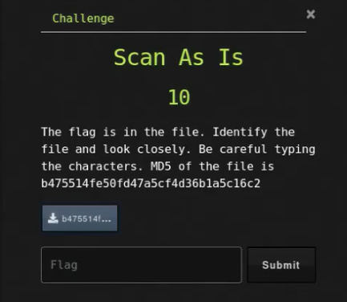

# Scan As Is

## Challenge



## Solution

We need to check what file it is.

```bash
file 195375ef78976640c01363f300c2833b
```

We  have a PNG image file. Opening it, we can see a qr code, we just need to scan it. Using a flaptak application called "QR Scanner" by lasheen, we can extract the text from theqr code.

## FLAG

```text
uCTF{8_bVDVd:SSboF#U3yh}
```
